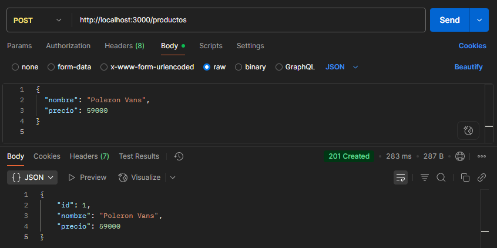
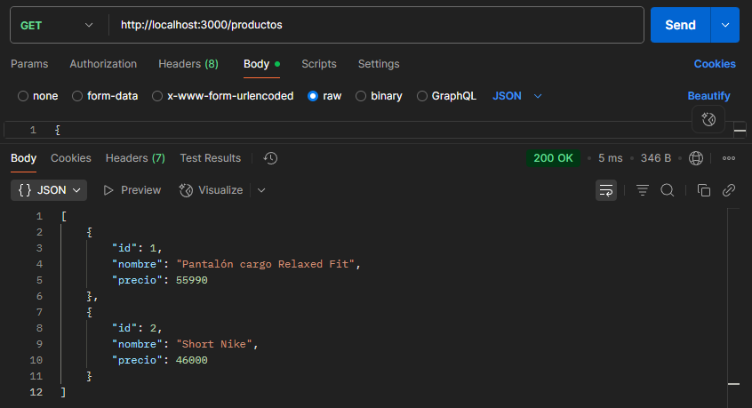
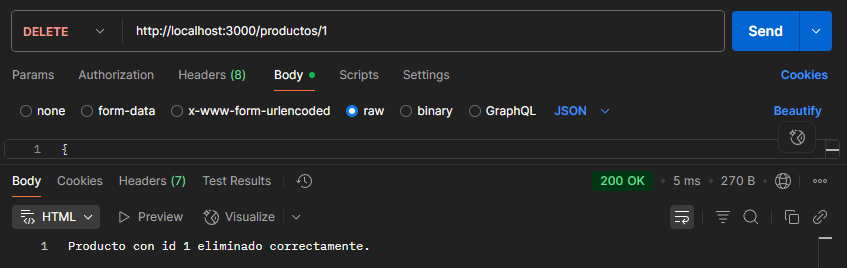
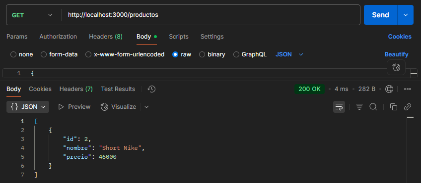

# 🛠️ **NestJS CRUD Básico** de Productos

Una **API RESTful** construida con **NestJS** para gestionar productos. Este proyecto fue desarrollado como ejercicio práctico para aprender los fundamentos del framework, incluyendo controladores, servicios, DTOs, validación y enrutamiento básico.

---

## 📋 Tabla de Contenidos

- [📌 Endpoints disponibles](#-endpoints-disponibles)
- [🛠️ Tecnologías Utilizadas](#️-tecnologías-utilizadas)
- [💡 Qué aprendí](#-qué-aprendí)
- [🔧 Instalación y Uso](#-instalación-y-uso)
- [📸 Screenshots desde Postman](#-screenshots-desde-postman)

---

## 📌 Endpoints disponibles

Estas son las principales tecnologías empleadas en el desarrollo del proyecto:

| Método   | Ruta             | Acción                          |
| -------- | ---------------- | ------------------------------- |
| `GET`    | `/productos`     | Lista todos los productos       |
| `POST`   | `/productos`     | Crea un nuevo producto          |
| `PUT`    | `/productos/:id` | Actualiza un producto existente |
| `DELETE` | `/productos/:id` | Elimina un producto por ID      |

---

## 🛠️ Tecnologías Utilizadas

- 🧠 **TypeScript**
- 🐦 **NestJS**
- ⚙️ **Node.js**
- 🛡️ **class-validator**

---

## 💡 Qué aprendí

- Organización modular con decoradores como **@Module**, **@Controller** y **@Injectable**.
- Validación de datos utilizando **class-validator**.
- Uso de decoradores como **@Body**, **@Param**, **@Post**, **@Get**, **@Put** y **@Delete**.
- Aplicación de pipes como **ParseIntPipe**.
- Buenas prácticas con **interfaces** y tipado en **TypeScript**.

---

## 🔧 Instalación y Uso

1. **Clona el repositorio:**
git clone https://github.com/Raaspy/Nest-Api.git
cd nest-api

2. **Instala las dependencias:**
npm install

3. **Levanta el servidor:**
npm run start:dev

4. **En PostMan, La API estará disponible en:**
http://localhost:3000/productos

---

## 📸 Screenshots desde Postman

#### 🟢 Crear producto

#### 🔵 Obtener productos

#### 🟡 Actualizar producto

#### 🔴 Eliminar producto

